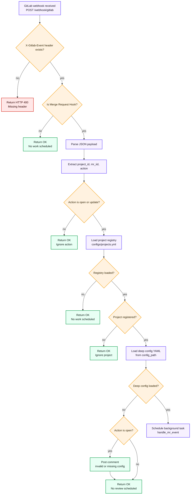
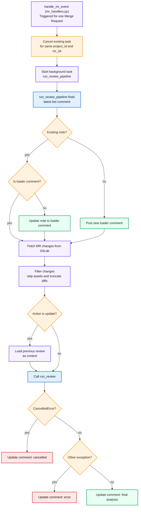

# GitLab Webhook Receiver

This repository contains a small FastAPI service that listens for GitLab Merge Request webhook events. When a Merge Request is opened or updated, the service:

- loads the correct project configuration from YAML files in this repo
- fetches the Merge Request changes from GitLab
- converts those changes into the format the review engine expects
- runs the review pipeline
- posts or updates a Merge Request comment with the results

There is also one important behavior built into the service: cancellation. If GitLab sends a new event for the same Merge Request while a review is still running, the previous in-flight review is cancelled and replaced with the new one.

---

## Purpose (what problem this solves)

GitLab can send webhook events whenever a Merge Request is opened or updated. This service turns those events into an automated review workflow:

1. Fast webhook response (GitLab does not wait for the review to finish)
2. One active review per Merge Request (latest event wins)
3. Progress visibility (the bot comment shows a loader while work is running)
4. Clear final output (the bot comment is updated with the analysis)

---

## What this service expects from GitLab

### Endpoint

The main endpoint is:

- `POST /webhook/gitlab`

### Required header

GitLab must send:

- `X-Gitlab-Event: Merge Request Hook`

If that header is missing, the service returns a 400 error.

### JSON payload fields this repo uses

Inside the webhook JSON, this repo reads:

- `project.id`
- `object_attributes.iid` (the Merge Request IID)
- `object_attributes.action` (the action type)

### Supported action values

This repo only schedules work when:

- `object_attributes.action` is `open`
- `object_attributes.action` is `update`

Other actions are ignored.

---

## Quick start: local development

### 1. Install dependencies with uv

```bash
uv sync
```

### 2. Configure environment variables

Copy the template:

```bash
cp .env.example .env
```

Edit `.env` and set:

- `GITLAB_URL`
- `GITLAB_TOKEN`
- `LOG_LEVEL` (optional, defaults to `INFO`)

`GITLAB_TOKEN` should be a Personal Access Token with enough permissions to read Merge Requests and to create and update Merge Request notes (comments).

### 3. Run the server

```bash
uv run uvicorn app.main:deephook --reload
```

The default local port is `8000`.

### 4. Sanity check

Open:

- `GET /`

You should see:

- a small JSON message that says the server is running

---

## Quick start: GitLab webhook wiring

In GitLab for your project:

1. Go to Project Settings
2. Open Webhooks
3. Add a webhook pointing to:
   - `http://your-server-ip:8000/webhook/gitlab`
4. Set the event to Merge request events
5. Ensure comments are included (this repo handles Merge Request Hook events)
6. Use SSL verification if you are using HTTPS

Note: this repo does not implement a webhook secret/token check. If you need that for production, you should add request signature validation.

---

## Quick start: run the included tests

### Test webhook (open event)

```bash
chmod +x test_webhook.sh
./test_webhook.sh
```

This script sends a sample `Merge Request Hook` webhook with `action` set to `open` to:

- `POST http://localhost:8000/webhook/gitlab`

### Test cancellation behavior

```bash
chmod +x test_concurrency.sh
./test_concurrency.sh
```

This script sends two quick `update` events for the same Merge Request. The expectation is:

- the first running review is cancelled
- the second review starts and completes

---

## System runtime flow (two diagrams)

These diagrams describe the control flow implemented in this repo. The review engine itself is treated as a black box; this service prepares inputs, calls it, and then updates the Merge Request comments with results.

### Diagram A: Webhook request handling


Human-friendly summary:

- If the event is not the right Merge Request Hook header, work is not scheduled.
- If the action is not `open` or `update`, work is not scheduled.
- If the project is not listed in `configs/projects.yml`, the event is ignored.
- If the deep config YAML cannot be loaded:
  - the error is logged
  - for `open` actions only, the service posts a comment explaining what is wrong

### Diagram B: Review pipeline and cancellation


Human-friendly cancellation summary:

- The service tracks active reviews per `(project_id, mr_iid)`.
- When a new webhook event arrives for the same Merge Request, it cancels the previous task.
- If cancellation happens after a bot comment exists, the bot comment is updated to show that the run was cancelled.

---

## Configuration files in this repo

### `.env` and `.env.example`

`.env.example` provides placeholders:

- `GITLAB_URL`
- `GITLAB_TOKEN`
- `LOG_LEVEL`

The service loads `.env` automatically using `python-dotenv` at startup.

### `configs/projects.yml`

This file is a registry that routes GitLab project IDs to a deep config YAML path.

The mapping format is:

- `projects` at the top level
- each project ID maps to an object that contains `config_path`

If a GitLab project ID is not found here, this service ignores the webhook event for that project.

### `configs/deep/*.deep.yml`

Each deep YAML file is loaded per project and forwarded to the review engine configuration loader.

This repository includes an example:

- `configs/deep/80180134.deep.yml`

Inside that YAML you will find settings such as:

- the target language
- global guidelines and per-file-pattern guidelines
- LLM provider settings
- review limits
- optional MCP server configuration

This repo itself does not interpret those fields deeply; it forwards the configuration to the review engine.

---

## Purpose of each file (repo-only)

### `app/main.py`

Creates the FastAPI application and mounts the webhook router.

It also:

- loads `.env` with `load_dotenv()`
- configures logging using `LOG_LEVEL`
- currently prints the `ANTHROPIC_API_KEY` environment variable on startup

That print can be useful while developing locally, but be careful with secrets in logs.

### `app/webhook.py`

Implements the webhook endpoint:

- `POST /webhook/gitlab`

Responsibilities in this repo:

- validate the `X-Gitlab-Event` header
- parse JSON payload
- extract `project_id`, `mr_iid`, and `action`
- only schedule work for `action` values `open` and `update`
- load the project registry from `configs/projects.yml`
- load the deep YAML configuration for that project
- schedule `handle_mr_event` as a FastAPI background task

Deep config failure behavior:

- on any deep config error, the service logs the problem
- for `open` actions only, it posts a helpful comment to the Merge Request describing the issue

### `app/handlers/mr_handlers.py`

This is where per-MR orchestration happens.

For each incoming event, it:

- cancels any active review task for the `(project_id, mr_iid)` pair
- starts a new background task by calling `run_review_pipeline(...)`

### `app/task_manager.py`

This file owns the cancellation tracking.

It is a singleton `TaskManager` with:

- `active_tasks`, a dictionary keyed by `(project_id, mr_iid)`
- `cancel_task(project_id, mr_iid)` to cancel and remove the current task
- `add_task(project_id, mr_iid, coro)` to start and store a new asyncio task

The intended behavior is: you should cancel first, then add the new task. The request handler does that.

### `app/config.py`

Uses `pydantic-settings` to read:

- `GITLAB_URL`
- `GITLAB_TOKEN`
- `LOG_LEVEL`

from your `.env`.

### `app/deep_config.py`

Loads the project registry used by the webhook route.

In this repo, its main job is:

- `load_project_registry()` which reads `configs/projects.yml` and returns a mapping from `project_id` to `config_path`

It also defines:

- `DeepConfigError` for consistent errors when the registry YAML is missing or malformed

Note: the actual deep YAML parsing and conversion into the review engine configuration is done by the review engine loader inside `app/webhook.py`.

### `app/gitlab_client.py`

All GitLab HTTP interactions live here.

It wraps GitLab REST calls using `httpx.AsyncClient` and sets:

- `PRIVATE-TOKEN` from `GITLAB_TOKEN`

This repo uses it to:

- get the current bot user ID
- fetch Merge Request notes (comments)
- post and update Merge Request notes
- fetch Merge Request changes

### `app/services/change_converter.py`

Converts GitLab Merge Request change data into the internal change objects expected by the review engine.

It also applies two important quality rules:

- it skips non-review-relevant paths (images, assets, lock files, and common build directories)
- it truncates overly large diffs so the review stays manageable

### `app/services/review_service.py`

This is the main pipeline runner.

In this repo, it:

- finds the last bot comment for the Merge Request (and decides if it is a loader or a completed review)
- ensures a loader comment exists while work is running
- fetches MR changes and converts them
- for `update` actions, attempts to load previous completed review text as context
- calls the review engine to produce the final markdown result
- updates the Merge Request comment with:
  - the final analysis
  - or a cancellation message
  - or an error message

### `configs/projects.yml`

Routes GitLab project IDs to deep config YAML paths.

If a project ID is missing, the webhook event is ignored.

### `configs/deep/80180134.deep.yml`

Example deep configuration for one project.

This file is loaded and forwarded during webhook handling.

### `test_webhook.sh`

A local webhook smoke test.

It sends a sample `Merge Request Hook` with `action` set to `open`.

### `test_concurrency.sh`

A local concurrency test.

It sends two quick `update` events for the same project and Merge Request IID so you can observe task cancellation behavior.

### `Dockerfile`

Builds a container image for this FastAPI service.

It:

- installs git
- runs `uv sync`
- starts the FastAPI app on port `8080`

### `pyproject.toml`

Declares project metadata and dependencies, including FastAPI, uvicorn, and the review engine integration package.

---

## Troubleshooting

### Webhook arrives, but nothing seems to happen

In this repo, that usually means one of these is true:

- the `X-Gitlab-Event` header is missing or not set to `Merge Request Hook`
- the payload action is not `open` or `update`
- the `project.id` is not present in `configs/projects.yml`

### Deep config errors

When the deep config YAML cannot be loaded:

- the error is written to logs
- for `open` actions, a bot comment is posted telling you what path failed

### You see repeated comments

That can be normal.

This repo tries to reuse an existing bot comment:

- it identifies bot notes that start with the review header
- it treats a loader comment differently from completed reviews

### Cancellation surprises

If you send multiple webhook events quickly for the same Merge Request:

- only the newest scheduled review should be the one that finishes
- previous tasks are cancelled
- the bot comment may show a cancelled message if the run is cancelled after it created or reused a comment

---

## Developer commands

### Lint

```bash
uv run ruff check .
```
